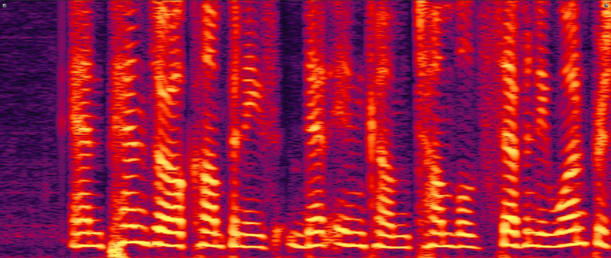
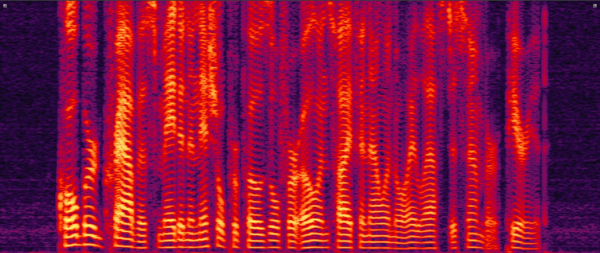
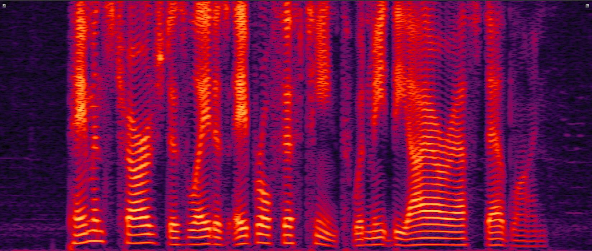
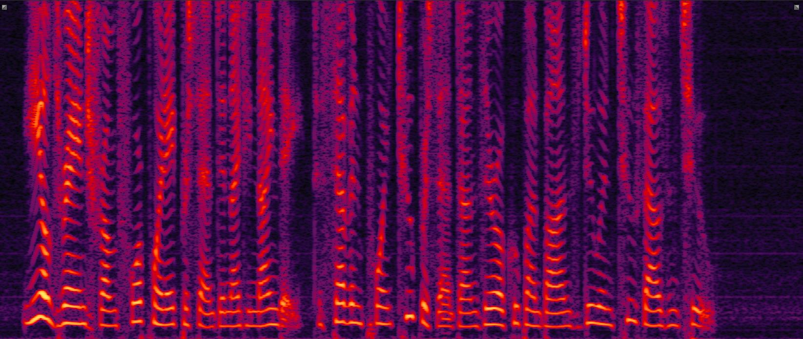

## X-SepFormer
X-SepFormer: End-to-end Speaker Extraction Network with Explicit Optimization on Speaker Confusion

## Introduction
This is a [demo](https://llearner.github.io/X-SepFormer.github.io/) for our paper **X-SepFormer: End-to-end Speaker Extraction Network with Explicit Optimization on Speaker Confusion**. 
We list some speech examples of our baseline system and compare our proposed methods with it.

If you have any questions or suggestions, please contact liukai89@huawei.com

## Examples
We divided examples into three categories: 1.Female-Male Mixtures; 2. Male-Male Mixtures; 3.Female-Female Mixtures
For better display, we divided each category into two groups.

### 1. Female - Male Mixtures (Group 1 & 2)

| 
Mixture
 | 
Enrollment
 | 
Baseline
 | 
X-SepFormer(S2)*
 | 
X-SepFormer(S3)*
 | 
Ground-Truth
 | 
| :--- | :--- | :--- | :--- | :--- | :--- |
|<audio src="examples/Female-Male/item4792_mix.wav" controls preload></audio>|<audio src="examples/Female-Male/item4792_aux.wav" controls preload></audio>|<audio src="examples/Female-Male/baseline/item4792_source1hat.wav" controls preload></audio>|<audio src="examples/Female-Male/x-sepformer-s2/item4792_source1hat.wav" controls preload></audio>|<audio src="examples/Female-Male/x-sepformer-s3/item4792_source1hat.wav" controls preload></audio>|<audio src="examples/Female-Male/item4792_source1.wav" controls preload></audio>|
|||||||
|<audio src="examples/Female-Male/item388_mix.wav" controls preload></audio>|<audio src="examples/Female-Male/item388_aux.wav" controls preload></audio>|<audio src="examples/Female-Male/baseline/item388_source1hat.wav" controls preload></audio>|<audio src="examples/Female-Male/x-sepformer-s2/item388_source1hat.wav" controls preload></audio>|<audio src="examples/Female-Male/x-sepformer-s3/item388_source1hat.wav" controls preload></audio>|<audio src="examples/Female-Male/item388_source1.wav" controls preload></audio>|
|||||||

| 
Mixture
 | 
Enrollment
 | 
Baseline
 | 
X-SepFormer(S2)*
 | 
X-SepFormer(S3)*
 | 
Ground-Truth
 | 
| :--- | :--- | :--- | :--- | :--- | :--- |
|<audio src="examples/Female-Male/item3616_mix.wav" controls preload></audio>|<audio src="examples/Female-Male/item3616_aux.wav" controls preload></audio>|<audio src="examples/Female-Male/baseline/item3616_source1hat.wav" controls preload></audio>|<audio src="examples/Female-Male/x-sepformer-s2/item3616_source1hat.wav" controls preload></audio>|<audio src="examples/Female-Male/x-sepformer-s3/item3616_source1hat.wav" controls preload></audio>|<audio src="examples/Female-Male/item3616_source1.wav" controls preload></audio>|
|||||||
|<audio src="examples/Female-Male/item298_mix.wav" controls preload></audio>|<audio src="examples/Female-Male/item298_aux.wav" controls preload></audio>|<audio src="examples/Female-Male/baseline/item298_source1hat.wav" controls preload></audio>|<audio src="examples/Female-Male/x-sepformer-s2/item298_source1hat.wav" controls preload></audio>|<audio src="examples/Female-Male/x-sepformer-s3/item298_source1hat.wav" controls preload></audio>|<audio src="examples/Female-Male/item298_source1.wav" controls preload></audio>|
|||||||

### 2. Male - Male Mixtures (Group 1 & 2)

| 
Mixture
 | 
Enrollment
 | 
Baseline
 | 
X-SepFormer(S2)*
 | 
X-SepFormer(S3)*
 | 
Ground-Truth
 | 
| :--- | :--- | :--- | :--- | :--- | :--- |
|<audio src="examples/Male-Male/item2719_mix.wav" controls preload></audio>|<audio src="examples/Male-Male/item2719_aux.wav" controls preload></audio>|<audio src="examples/Male-Male/baseline/item2719_source1hat.wav" controls preload></audio>|<audio src="examples/Male-Male/x-sepformer-s2/item2719_source1hat.wav" controls preload></audio>|<audio src="examples/Male-Male/x-sepformer-s3/item2719_source1hat.wav" controls preload></audio>|<audio src="examples/Male-Male/item2719_source1.wav" controls preload></audio>|
|||||||
|<audio src="examples/Male-Male/item4101_mix.wav" controls preload></audio>|<audio src="examples/Male-Male/item4101_aux.wav" controls preload></audio>|<audio src="examples/Male-Male/baseline/item4101_source1hat.wav" controls preload></audio>|<audio src="examples/Male-Male/x-sepformer-s2/item4101_source1hat.wav" controls preload></audio>|<audio src="examples/Male-Male/x-sepformer-s3/item4101_source1hat.wav" controls preload></audio>|<audio src="examples/Male-Male/item4101_source1.wav" controls preload></audio>|
|||||||

| 
Mixture
 | 
Enrollment
 | 
Baseline
 | 
X-SepFormer(S2)*
 | 
X-SepFormer(S3)*
 | 
Ground-Truth
 | 
| :--- | :--- | :--- | :--- | :--- | :--- |
|<audio src="examples/Male-Male/item610_mix.wav" controls preload></audio>|<audio src="examples/Male-Male/item610_aux.wav" controls preload></audio>|<audio src="examples/Male-Male/baseline/item610_source1hat.wav" controls preload></audio>|<audio src="examples/Male-Male/x-sepformer-s2/item610_source1hat.wav" controls preload></audio>|<audio src="examples/Male-Male/x-sepformer-s3/item610_source1hat.wav" controls preload></audio>|<audio src="examples/Male-Male/item610_source1.wav" controls preload></audio>|
|||||||
|<audio src="examples/Male-Male/item4332_mix.wav" controls preload></audio>|<audio src="examples/Male-Male/item4332_aux.wav" controls preload></audio>|<audio src="examples/Male-Male/baseline/item4332_source1hat.wav" controls preload></audio>|<audio src="examples/Male-Male/x-sepformer-s2/item4332_source1hat.wav" controls preload></audio>|<audio src="examples/Male-Male/x-sepformer-s3/item4332_source1hat.wav" controls preload></audio>|<audio src="examples/Male-Male/item4332_source1.wav" controls preload></audio>|
|||||||

### 3. Female - Female Mixtures (Group 1 & 2)

| 
Mixture
 | 
Enrollment
 | 
Baseline
 | 
X-SepFormer(S2)*
 | 
X-SepFormer(S3)*
 | 
Ground-Truth
 | 
| :--- | :--- | :--- | :--- | :--- | :--- |
|<audio src="examples/Female-Female/item3573_mix.wav" controls preload></audio>|<audio src="examples/Female-Female/item3573_aux.wav" controls preload></audio>|<audio src="examples/Female-Female/baseline/item3573_source1hat.wav" controls preload></audio>|<audio src="examples/Female-Female/x-sepformer-s2/item3573_source1hat.wav" controls preload></audio>|<audio src="examples/Female-Female/x-sepformer-s3/item3573_source1hat.wav" controls preload></audio>|<audio src="examples/Female-Female/item3573_source1.wav" controls preload></audio>|
|||||||
|<audio src="examples/Female-Female/item3979_mix.wav" controls preload></audio>|<audio src="examples/Female-Female/item3979_aux.wav" controls preload></audio>|<audio src="examples/Female-Female/baseline/item3979_source1hat.wav" controls preload></audio>|<audio src="examples/Female-Female/x-sepformer-s2/item3979_source1hat.wav" controls preload></audio>|<audio src="examples/Female-Female/x-sepformer-s3/item3979_source1hat.wav" controls preload></audio>|<audio src="examples/Female-Female/item3979_source1.wav" controls preload></audio>|
|||||||

| 
Mixture
 | 
Enrollment
 | 
Baseline
 | 
X-SepFormer(S2)*
 | 
X-SepFormer(S3)*
 | 
Ground-Truth
 | 
| :--- | :--- | :--- | :--- | :--- | :--- |
|<audio src="examples/Female-Female/item1667_mix.wav" controls preload></audio>|<audio src="examples/Female-Female/item1667_aux.wav" controls preload></audio>|<audio src="examples/Female-Female/baseline/item1667_source1hat.wav" controls preload></audio>|<audio src="examples/Female-Female/x-sepformer-s2/item1667_source1hat.wav" controls preload></audio>|<audio src="examples/Female-Female/x-sepformer-s3/item1667_source1hat.wav" controls preload></audio>|<audio src="examples/Female-Female/item1667_source1.wav" controls preload></audio>|
|||||||
|<audio src="examples/Female-Female/item1117_mix.wav" controls preload></audio>|<audio src="examples/Female-Female/item1117_aux.wav" controls preload></audio>|<audio src="examples/Female-Female/baseline/item1117_source1hat.wav" controls preload></audio>|<audio src="examples/Female-Female/x-sepformer-s2/item1117_source1hat.wav" controls preload></audio>|<audio src="examples/Female-Female/x-sepformer-s3/item1117_source1hat.wav" controls preload></audio>|<audio src="examples/Female-Female/item1117_source1.wav" controls preload></audio>|
|||||||

### Links

[[Demo GitHub](https://llearner.github.io/X-SepFormer.github.io/)]
